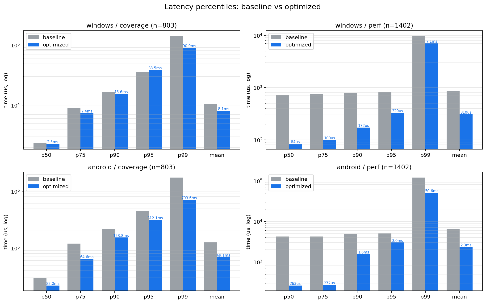
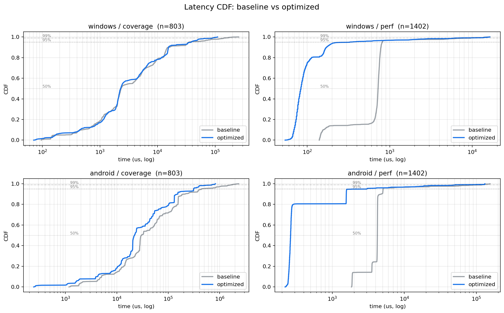
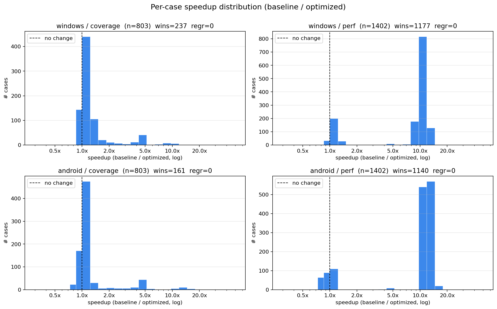
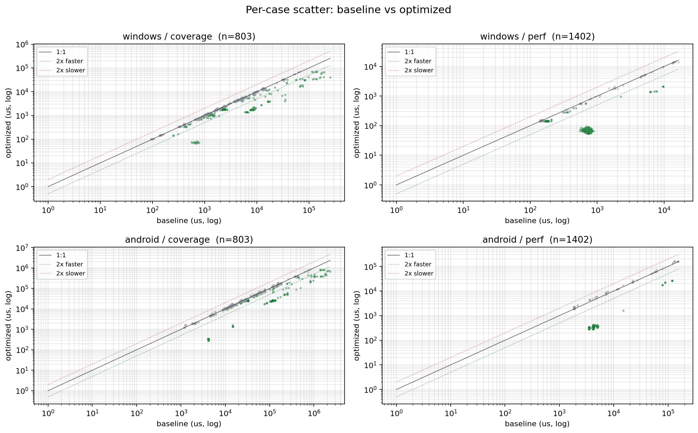

## 摘要

| 平台 | 集合 | mean | p99 |
|---|---|---|---|
| Windows MSVC x64 | coverage (n=803) | 10.5ms → **8.1ms** (1.29x) | 141ms → **90ms** (1.57x) |
| Windows MSVC x64 | perf (n=1402) | 854us → **310us** (2.75x) | 9.7ms → **7.1ms** (1.37x) |
| Android arm64 NEON | coverage (n=803) | 125ms → **69ms** (1.81x) | 1735ms → **704ms** (2.47x) |
| Android arm64 NEON | perf (n=1402) | 6.4ms → **2.3ms** (2.74x) | 120ms → **51ms** (2.37x) |

- Windows perf p50：**8.6x**，Android perf p50：**16.0x**
- Android 两个集合 **零回归**

## 优化点

| 编号 | 改动 | 解决的退化类型 |
|---|---|---|
| 1 | 缓存检查时尽量无锁处理 | 小 case 固定 mutex 开销（cat 3）|
| 2 | 中等 result + 中等 K 判定回退 OpenCV | GameStart 类稀疏适用区 |
| 3 | `K*result < 25M` 判定回退 OpenCV | SmileyOnWork 类长条 FFT |
| 4 | 极小 result 早返回限定 `K<2000` | InfrastTraining 类高 K 小 result |

## 流程

1. **基线测量** — `commit 5e78b23157` 之前的纯 OpenCV `cv::matchTemplate(..., mask)` 实现，分别在 Windows / Android 跑全量
2. **退化诊断** — 把 FFT/sparse 上线后的 latest 与 baseline 对比，按代码路径分类回归 case（cat 1-4）
3. **反复调参** — 对每个 case 用 Python 算出 `(K, result, K*result, n_dy)`，按这些维度做 bucket 分析，统计退化/中性/加速分布
4. **逐步优化 + 定向验证** — bench_matcher 支持指定 case 过滤，每一步只跑对应的回归子集（含正向 sanity case），避免噪声淹没改动
5. **全量回归** — Windows 串行跑 2 次取 min（噪声 10-15%）；Android K20 Pro 单次（噪声 <1%）
6. **正确性兜底** — `verify()` 用 `match_threshold=0.75` + `val_tol=2e-3`，跨 1 万次迭代正确性全过

## 测试集

| 集合 | 样本数 | 构造规则 |
|---|---:|---|
| coverage | 803 | 全部 `>=200ms` + 全部稀有 method (HSVCount/RGBCount) + 全部 multi-template + timing×scene 分层抽样 |
| perf | 1402 | 按生产 timing 分布加权采样，p50/p95  |

源：从 54973 个生产捕获 case 中抽样（`scripts/select_cases.py`）。

## 图表

### 分位延迟（log 纵轴）

### 延迟 CDF

### 单 case 加速分布（log 横轴）

### 散点对比（log-log，绿=加速、红=退化、灰=持平）

## 详细数据

Windows = min-of-2 runs，Android = single run。

| 平台 | 集合 | 指标 | baseline | optimized | speedup |
|---|---|---|---:|---:|---:|
| windows | coverage | p50 | 2,337us | 2,295us | 1.02x |
| | | p95 | 35,241us | 38,476us | 0.92x |
| | | p99 | 141,132us | 90,039us | **1.57x** |
| | | mean | 10,465us | 8,110us | **1.29x** |
| windows | perf | p50 | 723us | **84us** | **8.61x** |
| | | p95 | 813us | 329us | 2.47x |
| | | p99 | 9,714us | 7,074us | 1.37x |
| | | mean | 854us | 310us | **2.75x** |
| android | coverage | p50 | 30,016us | 21,992us | 1.36x |
| | | p95 | 442,340us | 312,105us | 1.42x |
| | | p99 | 1,734,833us | 703,608us | **2.47x** |
| | | mean | 125,176us | 69,116us | **1.81x** |
| android | perf | p50 | 4,219us | **263us** | **16.04x** |
| | | p95 | 5,071us | 3,027us | 1.68x |
| | | p99 | 119,905us | 50,578us | 2.37x |
| | | mean | 6,389us | 2,335us | **2.74x** |

## 残留与噪声

| 现象 | 说明 |
|---|---|
| Windows coverage p95 略升 (0.92x) | ~20 个 K\*result 在 25M 阈值边界的 case 进了 OpenCV fallback，绝对延迟在 30-50ms 段；mean/p99 大幅改善 |
| Windows perf 35 个回归 | 全部 <1.33x，绝对延迟 <500us，落在测量噪声内 |
| Windows noise floor | 同代码两次 run 的 case-wise diff：coverage p50 = 9.5%、perf p50 = 13%，故采用 min-of-2 |
| Android noise floor | 同代码 3 次 run 的差异 <1%，单次结果即可信 |

## 测量环境

| 平台 | 设备 / 构建 |
|---|---|
| Windows MSVC x64 | RelWithDebInfo, MSVC 19.x |
| Android arm64-v8a | Redmi K20 Pro / Android 11, NDK r29 RelWithDebInfo Clang, OpenCV 4.x |

详细见 `RegressionCases/baseline/README.md`。
